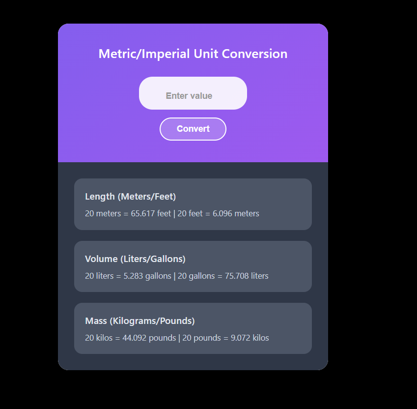

# Metric/Imperial Unit Converter

A clean, responsive web application for converting between metric and imperial units. This converter handles length, volume, and mass conversions with an intuitive interface and real-time calculations.



## Features

- **Multiple Unit Types**: Convert between metric and imperial units for:
  - Length (Meters ↔ Feet)
  - Volume (Liters ↔ Gallons)
  - Mass (Kilograms ↔ Pounds)

- **Real-time Conversion**: All three conversion types update simultaneously
- **Precise Calculations**: Results rounded down to 3 decimal places
- **Responsive Design**: Works seamlessly on desktop, tablet, and mobile devices
- **Clean Interface**: Modern purple gradient design with intuitive user experience
- **Keyboard Support**: Press Enter to convert or use the Convert button

## Installation

1. Download or clone the project files
2. Ensure all files are in the same directory:
   ```
   unit-converter/
   ├── index.html
   ├── styles.css
   ├── script.js
   └── README.md
   ```
3. Open `index.html` in your web browser

## Usage

1. Enter a numeric value in the input field
2. Click the "Convert" button or press Enter
3. View all conversions displayed in the result cards below

### Example
- Input: `20`
- Results:
  - Length: `20 meters = 65.617 feet | 20 feet = 6.096 meters`
  - Volume: `20 liters = 5.283 gallons | 20 gallons = 75.708 liters`
  - Mass: `20 kilos = 44.092 pounds | 20 pounds = 9.072 kilos`

## File Structure

### `index.html`
- Main HTML structure
- Links to external CSS and JavaScript files
- Semantic markup for accessibility

### `styles.css`
- Complete styling for the application
- Responsive design with mobile-first approach
- Purple gradient theme with modern aesthetics
- Smooth transitions and hover effects

### `script.js`
- All conversion logic and calculations
- Event handling for user interactions
- DOM manipulation for updating results
- Input validation and error handling

## Conversion Formulas

### Length
- **Meters to Feet**: `meters × 3.28084`
- **Feet to Meters**: `feet × 0.3048`

### Volume (US Gallons)
- **Liters to Gallons**: `liters × 0.264172`
- **Gallons to Liters**: `gallons × 3.78541`

### Mass
- **Kilograms to Pounds**: `kg × 2.20462`
- **Pounds to Kilograms**: `pounds × 0.453592`

## Technical Details

- **HTML5** semantic structure
- **CSS3** with modern features (flexbox, gradients, transitions)
- **Vanilla JavaScript** (ES6+)
- **No external dependencies** - runs entirely in the browser
- **Cross-browser compatible**

## Browser Support

- Chrome 60+
- Firefox 55+
- Safari 12+
- Edge 79+
- Mobile browsers (iOS Safari, Chrome Mobile)

## Customization

### Changing Colors
Edit the CSS variables in `styles.css`:
```css
.header {
    background: linear-gradient(135deg, #8B5CF6 0%, #A855F7 100%);
}
```

### Adding New Unit Types
1. Add HTML structure for new result card in `index.html`
2. Add styling in `styles.css`
3. Create conversion functions in `script.js`
4. Update the `updateResults()` function

### Modifying Precision
Change the rounding calculation in `script.js`:
```javascript
// Current: 3 decimal places
Math.floor(value * 1000) / 1000

// For 2 decimal places:
Math.floor(value * 100) / 100
```

## Contributing

1. Fork the repository
2. Create a feature branch
3. Make your changes
4. Test thoroughly across different browsers
5. Submit a pull request

## License

This project is open source and available under the [MIT License](LICENSE).

## Support

For questions or issues, please open an issue in the repository or contact the development team.

---

**Built with ❤️ using HTML, CSS, and JavaScript**